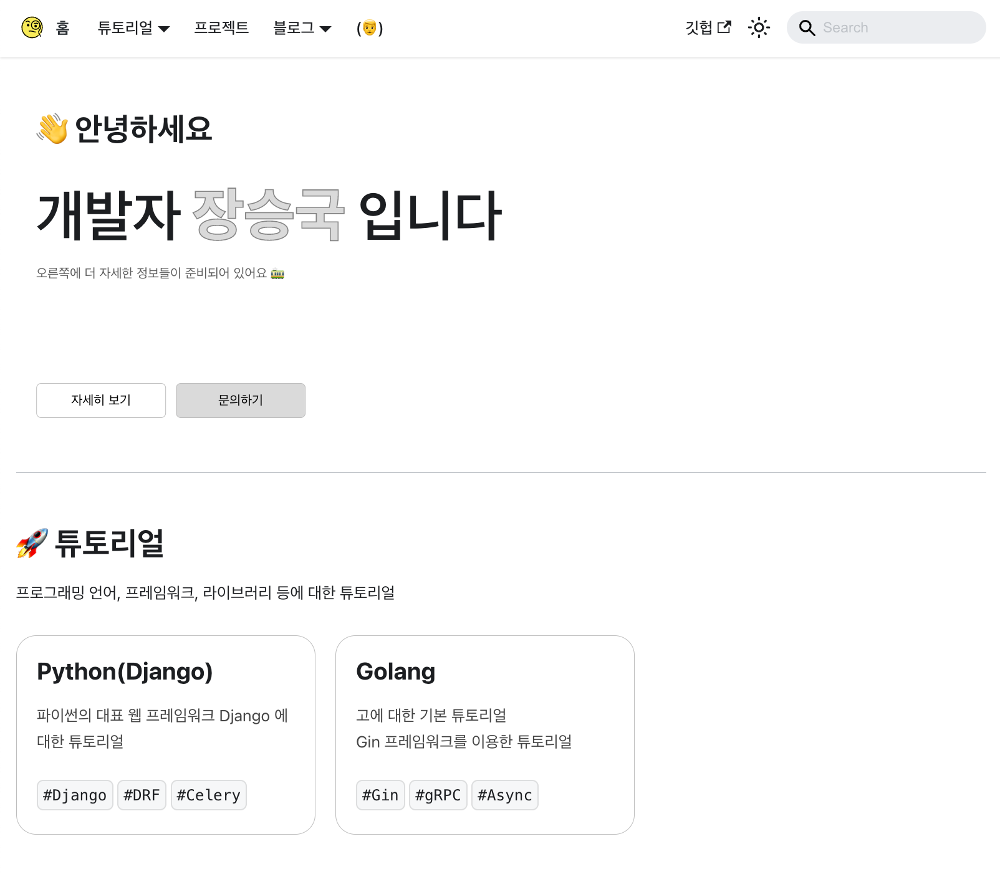
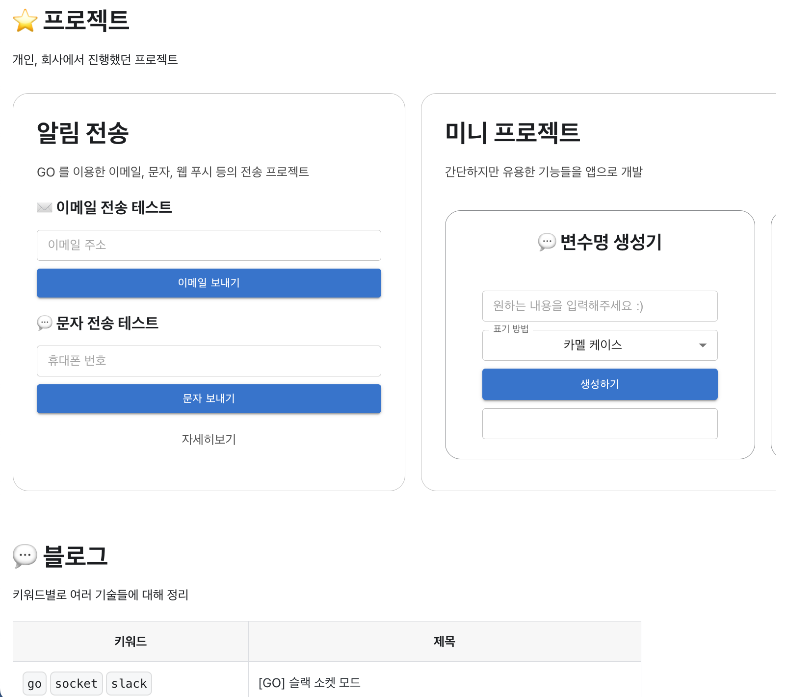
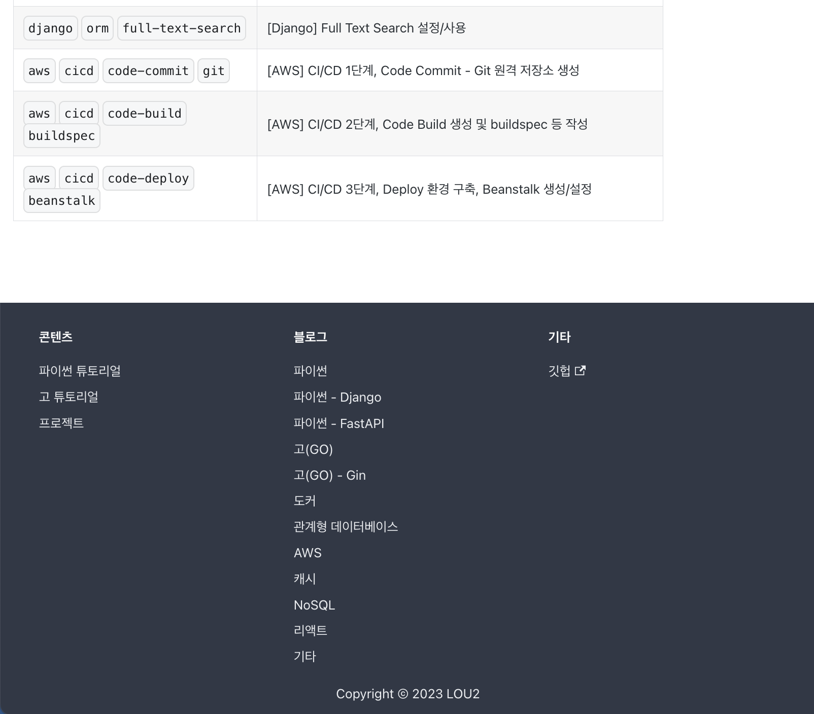

# 소개

 이 프로젝트는 제 개인 홈페이지를 만들기 위해 `Docusaurus`를 사용하여 개발되었습니다. 홈페이지는 파이썬과 고(Go)에 대한 튜토리얼을 제공하고, 제가 진행한 프로젝트에 대한 설명과 블로그를 통해 프로그래밍에 관련된 지식을 공유합니다. 또한, 제 소개와 연혁, 진행한 프로젝트들에 대한 자세한 내용을 제공합니다.

## 구성

이 프로젝트는 다음과 같은 구성으로 이루어져 있습니다

- [튜토리얼](https://lou2.kr/docs/category/%ED%8C%8C%EC%9D%B4%EC%8D%ACpython) : 파이썬과 고 등에 대한 튜토리얼
- [프로젝트](https://lou2.kr/docs/category/%ED%94%84%EB%A1%9C%EC%A0%9D%ED%8A%B8-%EA%B5%AC%EC%84%B1) : 진행한 프로젝트에 대한 설명과 테스트 UI 제공
- [블로그](https://lou2.kr/blog/python) : 프로그래밍에 관련된 지식을 공유하는 글
- [소개](https://lou2.kr/docs/iam) : 진행했던 프로젝트 및 상세

## 바로가기

### [🏠 홈페이지로 이동](https://lou2.kr)

## 미리보기

