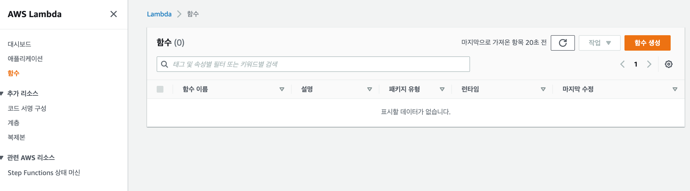
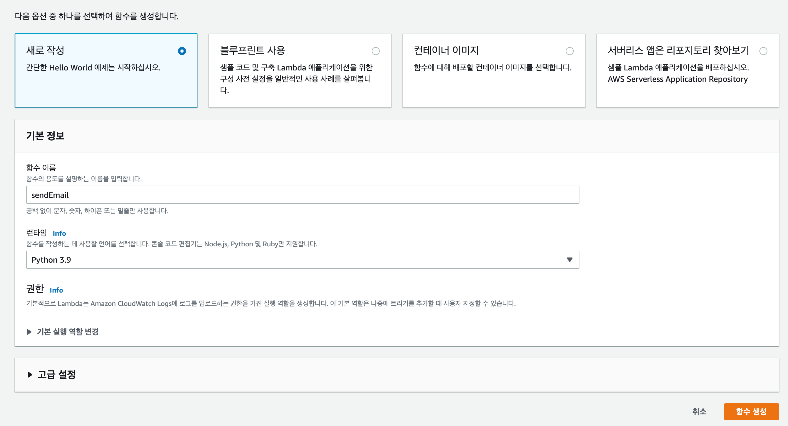
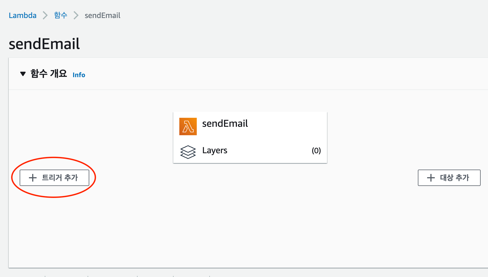
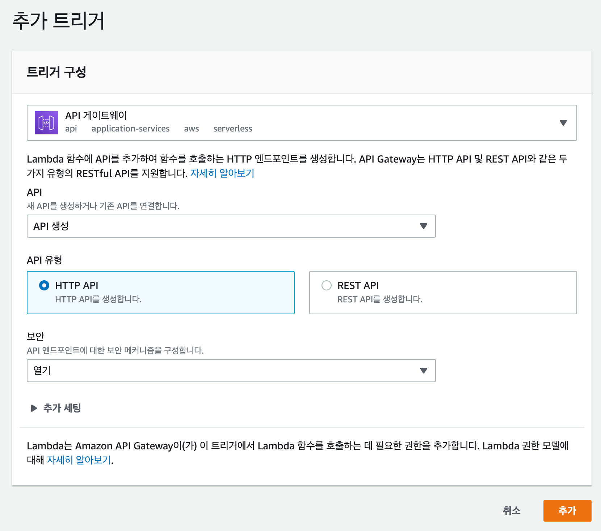
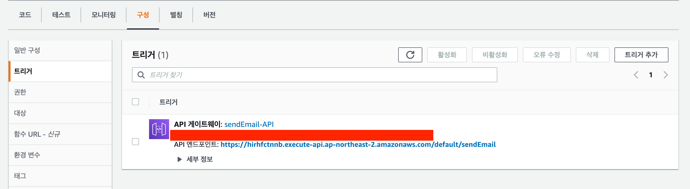
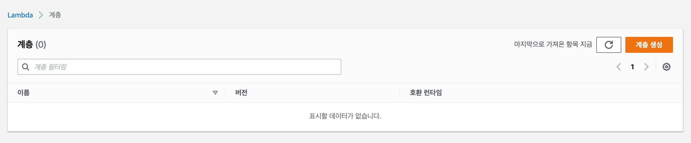
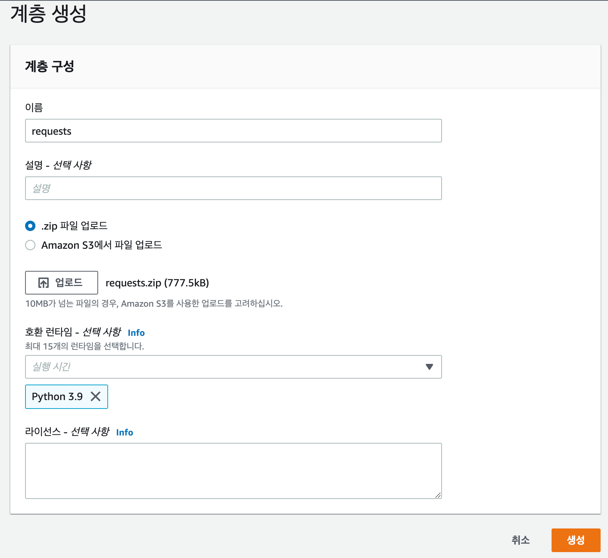
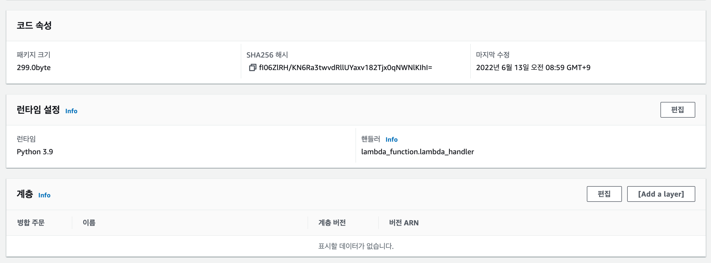
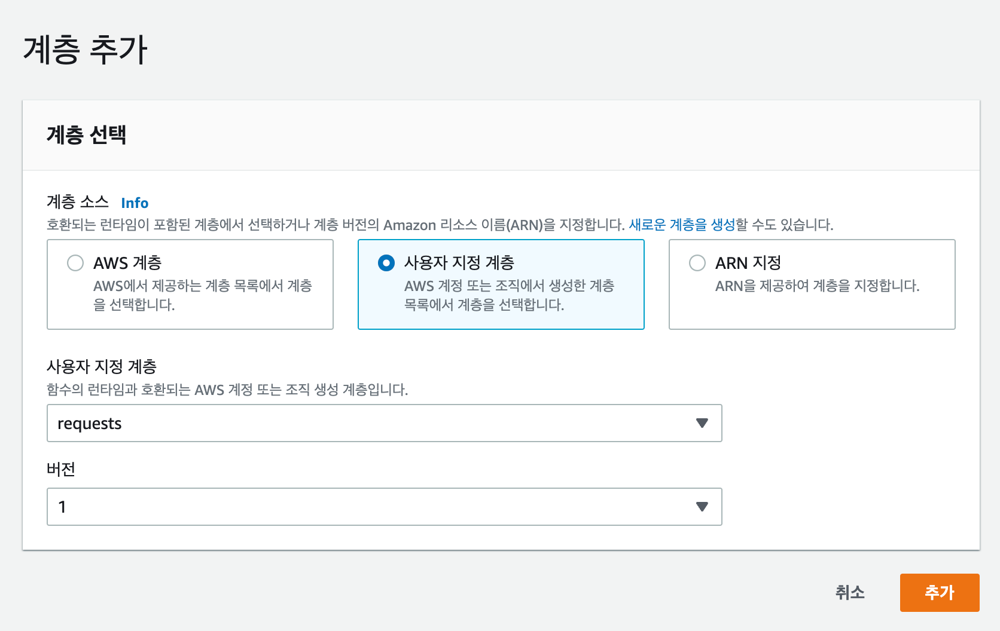
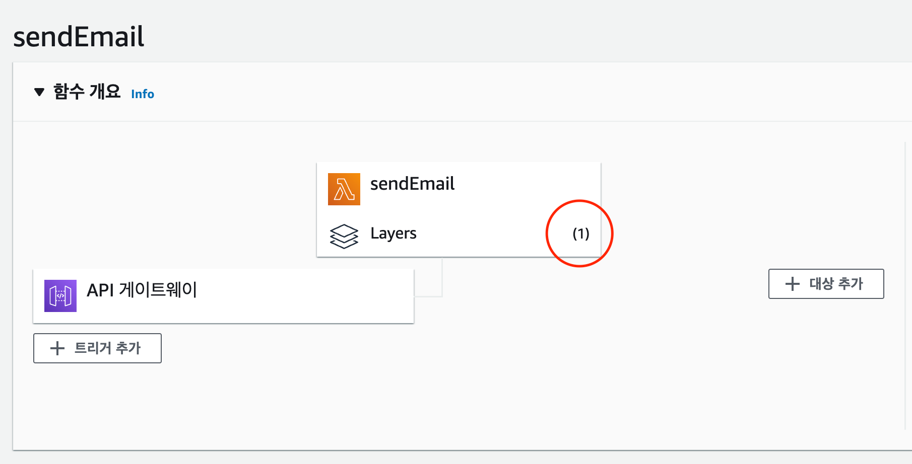

### Lambda 함수 생성 및 API Gateway 연동.

---

- Lambda 페이지로 이동

- 함수 생성

- 트리거 생성

- 트리거 속성 적용
    - 트리거 : APG 게이트웨이
    - API 유형 : HTTP API
    - 보안 : 열기(전체 접속 가능)

- 아래와 같이 URL 이 생성 됨

### Layer 추가.

---

- 라이브러리를 설치할 폴더로 이동
- 해당 폴더에 라이브러리 설치 `pip3 install requests -t python(폴더명)`
- 생성된 python 폴더를 압축 `zip -r requests.zip(압축할 파일명) python`
- Lambda > 계층으로 이동

- 계층 생성

- 다시 Lambda 함수로 이동하여 레이어 추가

- 사용자 지정 계층에 방금 생성한 계층을 추가

- 레이어가 1개 추가되며 requests 함수를 사용할 수 있게된다

