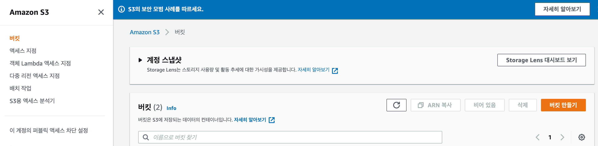
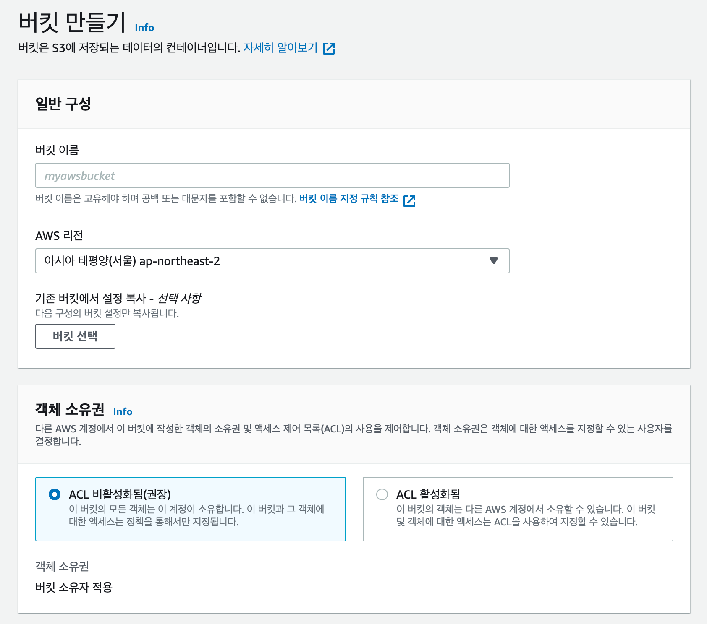
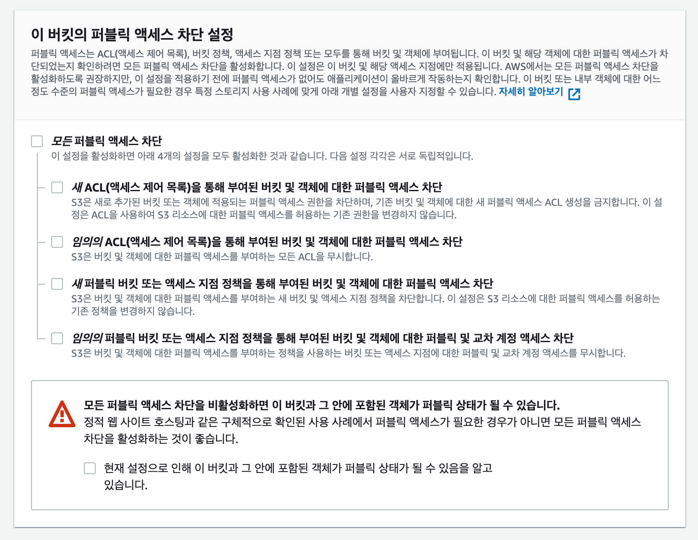
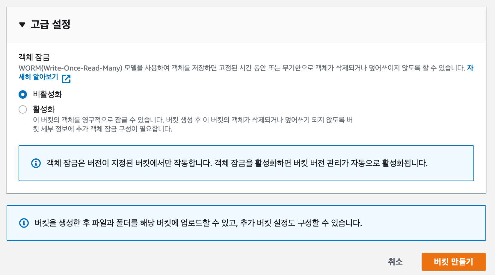
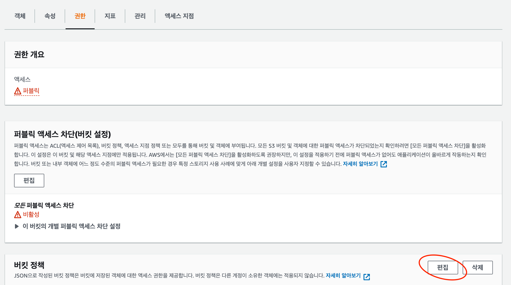
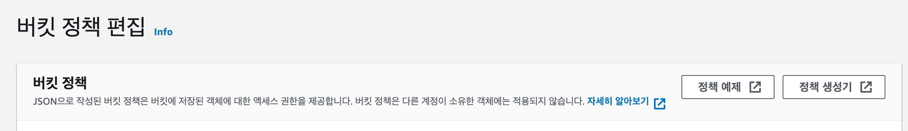
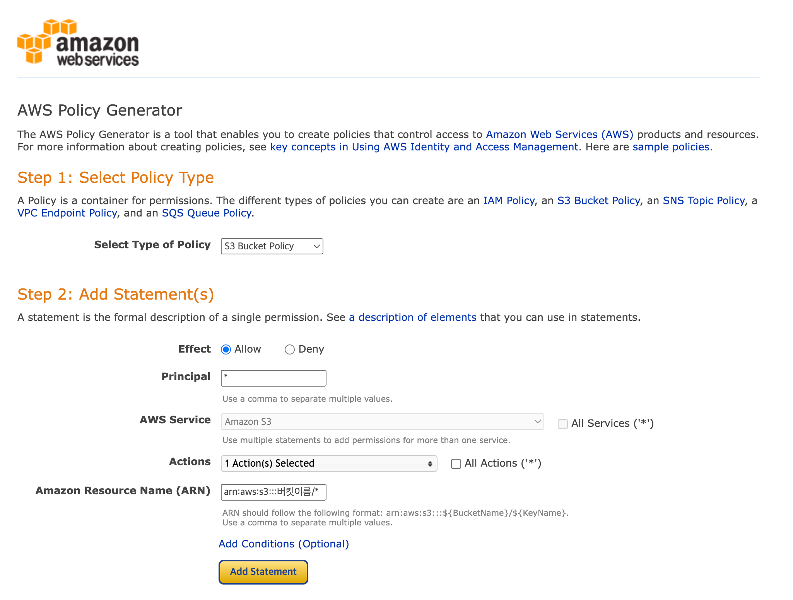
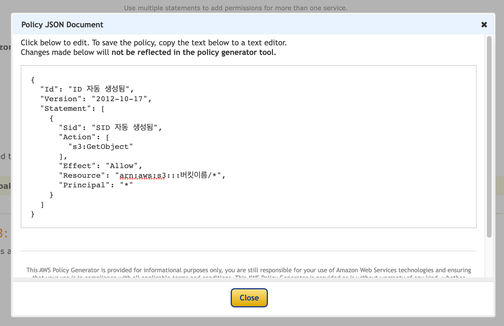

### 버킷 생성.

---

- S3 페이지로 이동

- 버킷 만들기
    - 버킷 이름 설정
    - 모든 퍼블릭 엑세스 차단 해제

- 버킷 내부로 이동 후 [권한] > [편집] 클릭

- 정책 생성기 클릭(https://awspolicygen.s3.amazonaws.com/policygen.html)

- 버킷 관련 정보 작성
    - Select Type of Policy : S3 선택
    - Effect : Allow
    - Principal : * (전체)
    - AWS Service : GetObject (컨텐트 조회 권한)
    - ARN : Amazon 리소스 이름(ARN)
        - arn:aws:s3:::버킷이름
        - 버킷 이름에 “/*” 를 꼭 붙여줘야함
        - ⇒ arn:aws:s3:::버킷이름/*

- 생성을 누르면 아래와 같이 JSON 형태로 값이 반환

- 이 값을 복사해서 S3 에 적용해주면 끝