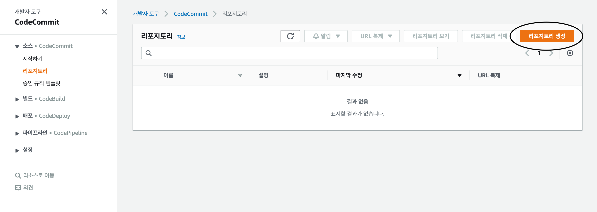
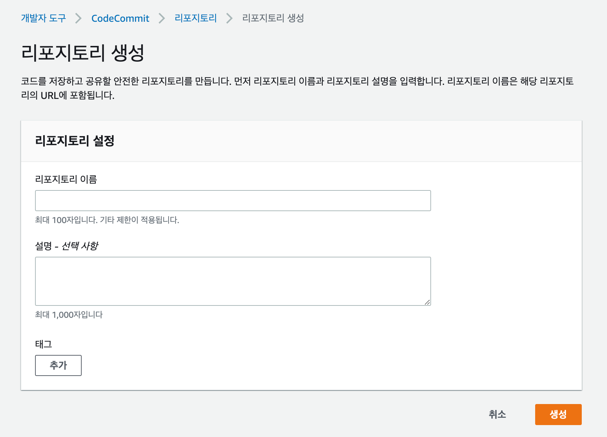
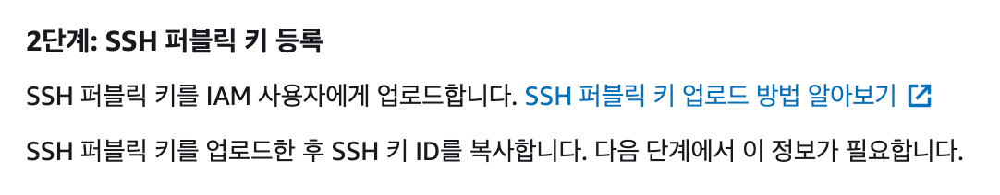
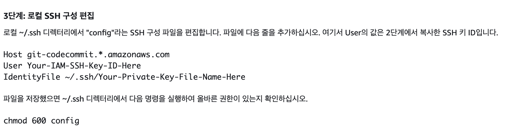
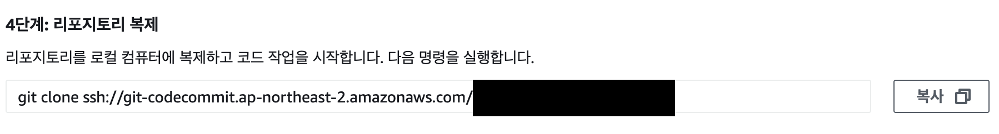

### Code Commit 생성.

---

- Code Commit 으로 이동



- 리포지토리 생성
    - 리포지토리 이름 : 원하는 이름 작성
    - 설명 : *선택 값*
    - 태그 : *선택 값*



- HTTPS, SSH 등 원하는 방식으로 저장소 연결
- **[연결 방법]** SSH - MacOS 기준
    - Git 설치
    - 퍼블릭키 등록
        - `ssh-keygen` 을 이용하면 퍼블릭키가 생성
        - IAM > 사용자 > 사용자 선택 > 보안 자격 증명 > SSH 퍼블릭키 업로드

  

    - ~/.ssh 디랙토리에 config 파일 생성 `vi ~/.ssh/config`
    - 아래 코드 복사하여 저장

    ```jsx
    Host git-codecommit.*.amazonaws.com
    User [IAM-SSH-Key-ID-를-입력]
    IdentityFile ~/.ssh/[Private-Key-File-Name-을-입력-기본-값-id_rsa]
    ```

    - `chmod 600 config` 로 권한 부여

  

    - 리포지토리 복제

  