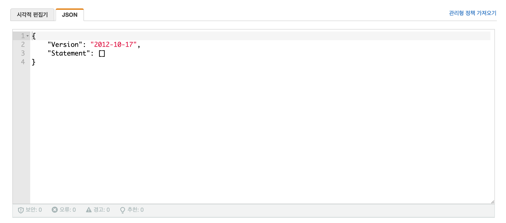
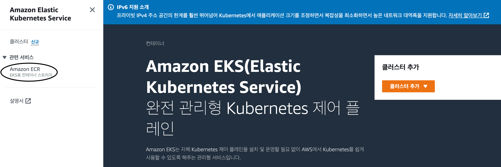

### BuildSpec 등 필요 파일 작성.

---

- 빌드에 필요한 파일 생성
    - 구조는 자신이 편한대로 작성
    - **buildspec** : 필드시 사용되는 명령어 집합체
    - **dockerfiles** : 도커 컨테이너 생성 파일
    - **dockerruns** : 배포시 사용될 설정 값
    - **requirements** : Django 배포시 사용되는 라이브러리 리스트


- buildspec 파일
    - echo : 진행 상황을 표시
    - aws ecr … : ecr 로그인 후 도커 접속
    - docker build … : $DOCKER_FILES_PATH 에 있는 Dockerfile 을 빌드
    - docker tag … : 태그 작성
    - docker push … : 도커 저장소에 배포
    - mv … : Dockerrun.aws.json 파일을 가져와서 설정 값 변경

```bash
version: 0.2

phases:
  pre_build:
    commands:
      - echo Logging in to Amazon ECR...
      - aws ecr get-login-password --region $AWS_DEFAULT_REGION | docker login --username AWS --password-stdin $AWS_ACCOUNT_ID.dkr.ecr.$AWS_DEFAULT_REGION.amazonaws.com
  build:
    commands:
      - echo Build started on `date`
      - echo Building the Docker image...
      - docker build -t $IMAGE_REPO_NAME:$IMAGE_TAG -f $DOCKER_FILES_PATH .
      - docker tag $IMAGE_REPO_NAME:$IMAGE_TAG $AWS_ACCOUNT_ID.dkr.ecr.$AWS_DEFAULT_REGION.amazonaws.com/$IMAGE_REPO_NAME:$IMAGE_TAG
  post_build:
    commands:
      - echo Build completed on `date`
      - echo Pushing the Docker image...
      - docker push $AWS_ACCOUNT_ID.dkr.ecr.$AWS_DEFAULT_REGION.amazonaws.com/$IMAGE_REPO_NAME:$IMAGE_TAG
      - mv build/dockerruns/Dockerrun.aws.api.json Dockerrun.aws.json
      - sed -i "s|__DOCKER_IMAGE__|$AWS_ACCOUNT_ID.dkr.ecr.$AWS_DEFAULT_REGION.amazonaws.com/$IMAGE_REPO_NAME:$IMAGE_TAG|g" Dockerrun.aws.json

artifacts:
    files:
    - 'Dockerrun.aws.json'
    - .ebextensions/**/*
```

- Dockerfile
    - ENV : 환경 변수
    - COPY : 복사
    - RUN : 빌드간 실행
    - WORKDIR : 작업 디렉토리
    - CMD : 컨테이너 실행시 사용할 명령어
    - EXPOSE : 80번 포트 개방

```docker
FROM        python:3.9.13

# ENV
ENV         LANG C.UTF-8
ENV         PYTHONUNBUFFERED 1

COPY        ./build/requirements/requirements.api.txt /app/requirements.txt
RUN         pip install -U pip
RUN         pip install -r /app/requirements.txt
COPY        . /app

WORKDIR     /app
CMD         python manage.py migrate; python manage.py collectstatic --no-input; gunicorn config.wsgi:application --bind 0.0.0.0:80 -c gunicorn.ini

EXPOSE      80
```

- Dockerrun.aws.json

```docker
{
    "AWSEBDockerrunVersion": "1",
    "Image": {
        "Name": "__DOCKER_IMAGE__",
        "Update": "true"
    },
    "Ports": [
        {
            "ContainerPort": "80"
        }
    ],
    "Logging": "/var/log/nginx"
}
```

- 파일 생성 후 원격 저장소에 push

### Code Build 생성.

---

- Code Build 페이지 이동


- 프로젝트 구성
    - 프로젝트 이름 : 원하는 이름 작성


- 소스
    - 소스 공급자 : Git 원격 저장소 설정
    - 리포지토리 : 해당 원격 저장소의 리포지토리 설정
    - 참조 유형 : 어떤 action 에 빌드를 할 것 인지 지정
    - 브랜치, 커밋 ID : 참조 유형에 해당되는 항목 지정


- 환경
    - 환경 이미지 : 원하는 이미지 선택
    - 운영 체제 : 원하는 운영체제 선택
    - 런타임, 이미지, 이미지 버전 : 원하는 환경 선택
    - 역할 이름 : 기존 역할 또는 신규 역할 지정
    - VPC, 컴퓨팅 : 원하는 항목 선택
    - 환경 변수 : 빌드에 사용되는 환경 변수 지정


- Buildspec
    - 파일로 사용할건지 직접 입력할건지 지정


- 배치 구성, 아티팩트 : 필요시 작성


- 로그


- 빌드


- 바로 빌드하면 아래와 같은 오류가 나온다
    - 그 원인은 IAM 역할 때문… 아래에서 역할 부여 방법 설명
    - 역할에 다음 권한을 추가해준다

    ```docker
    {
      "Action": [
        "ecr:BatchCheckLayerAvailability",
        "ecr:CompleteLayerUpload",
        "ecr:GetAuthorizationToken",
        "ecr:InitiateLayerUpload",
        "ecr:PutImage",
        "ecr:UploadLayerPart"
      ],
      "Resource": "*",
      "Effect": "Allow"
    },
    ```


- 추가로 ESR 에 생성될 컨테이너를 미리 추가해둬야한다

### IAM 역할 지정.

---

- IAM > 역할로 이동


- 생성한 역할 검색


- 권한 추가


- 정책 생성


- JSON 으로 선택

```docker
{
    "Version": "2012-10-17",
    "Statement": [
        {
          "Action": [
            "ecr:BatchCheckLayerAvailability",
            "ecr:CompleteLayerUpload",
            "ecr:GetAuthorizationToken",
            "ecr:InitiateLayerUpload",
            "ecr:PutImage",
            "ecr:UploadLayerPart"
          ],
          "Resource": "*",
          "Effect": "Allow"
        }
    ]
}
```



- 정책 생성 후 연결

### ESR 등록.

---

- ECR 서비스로 이동



- 리포지토리 생성


- 일반 설정
    - 표시 여부 설정 : 공개 여부 설정
    - 리포지토리 이름 : code build 시 생성되는 도커 컨테이너명


- 리포지토리 생성

