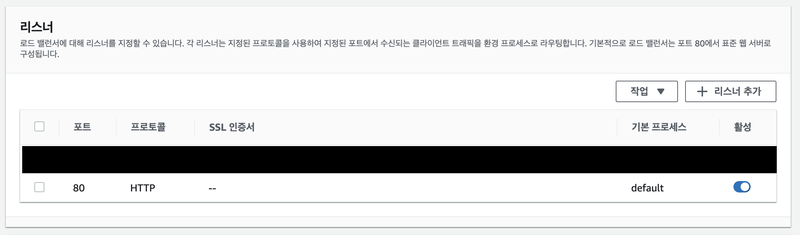
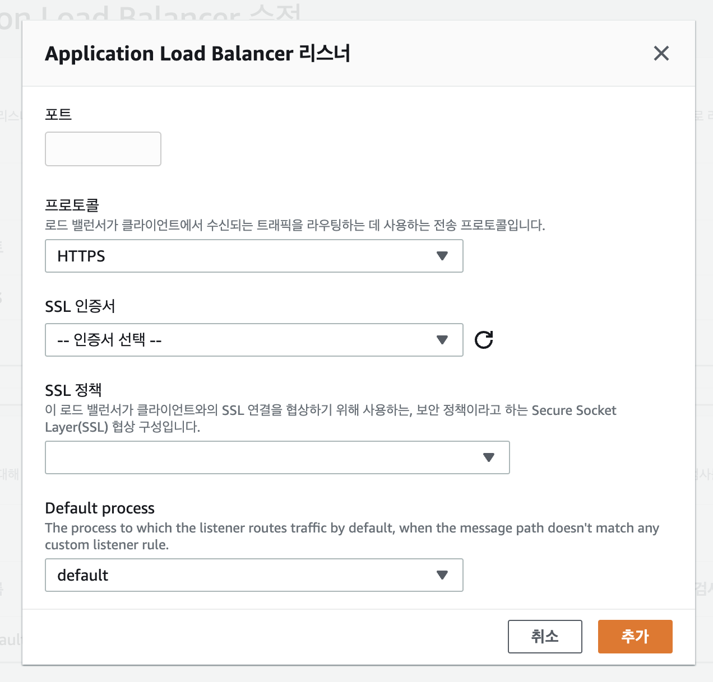
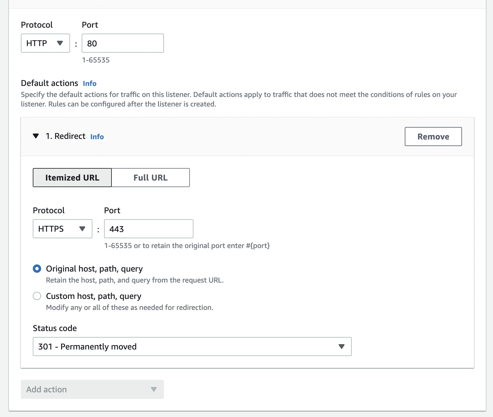

## HTTPS 적용.

---

- Beanstalk > 환경 > 구성 메뉴로 이동
- **리스너** 추가

- 리스너 설정
    - 포트 : 443
    - SSL : ACM 에서 인증서 생성 후 적용
    - SSL 정책 : ELBSecurityPolicy-2016-08

- 추가 후 **[적용]** 버튼 클릭

## HTTP 리다이렉션.

---

- ELB 페이지로 이동
- 원하는 ELB 선택 > 리스너
- 기존 HTTP(80포트) 리스너 편집 페이지로 이동

