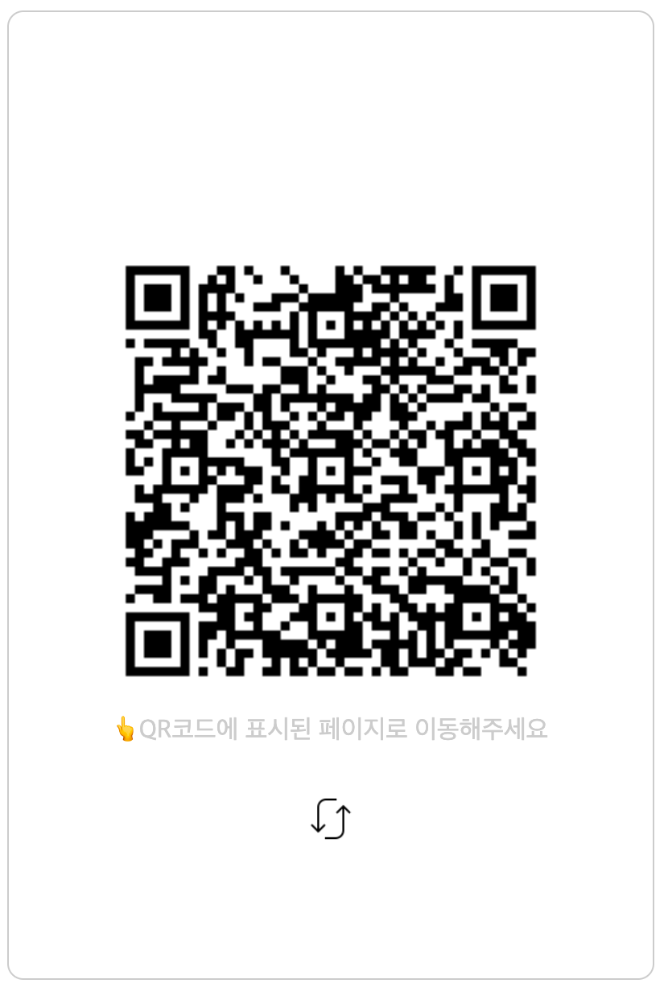
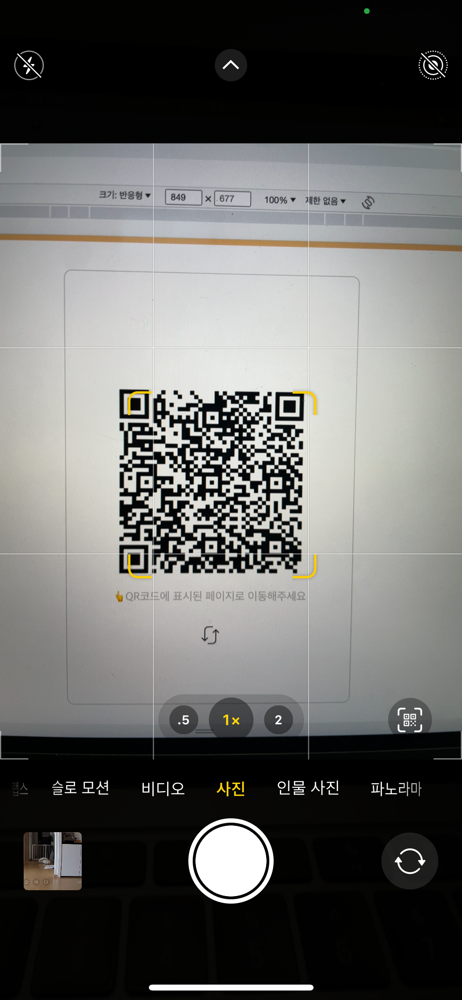
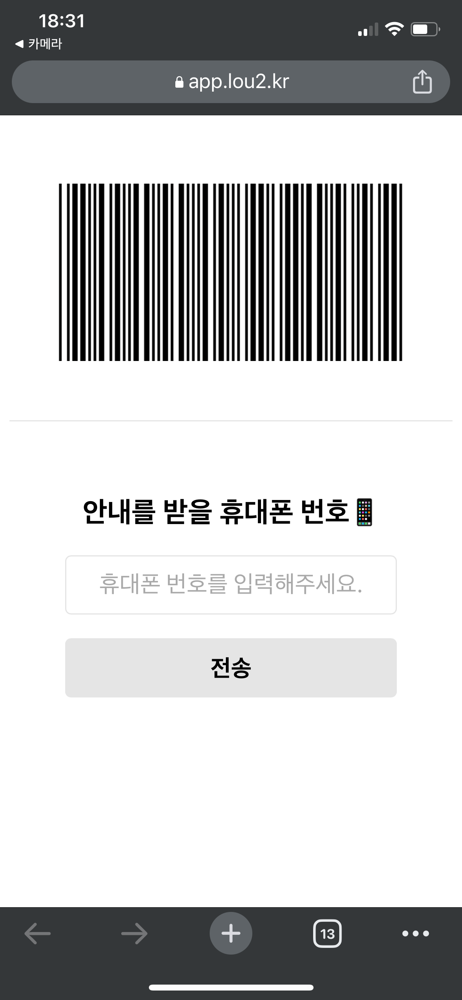
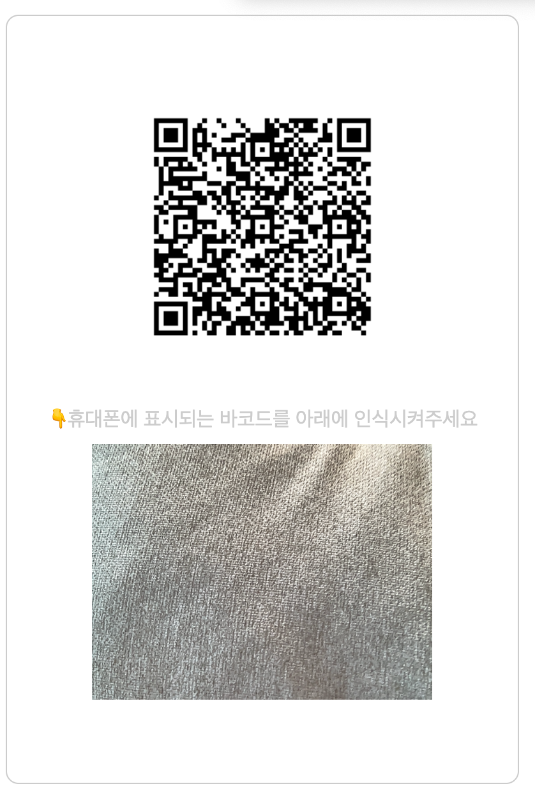
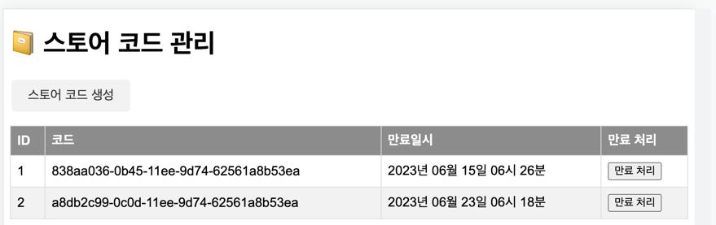
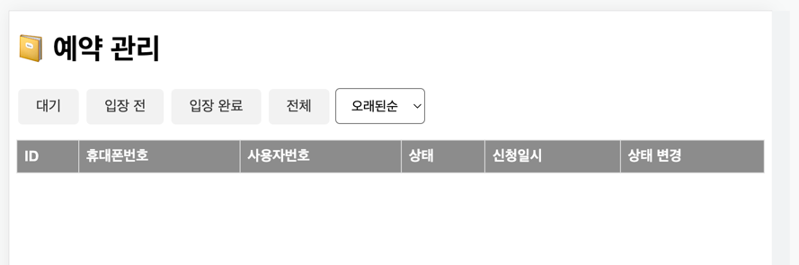

# ⏰ 웨이팅 서비스

## ⭐️영상 소개

준비중

## ⭐️ 테스트

| 종류           | 내용                                                                        |
|--------------|---------------------------------------------------------------------------|
| 관리자 - 코드 관리  | [app.lou2.kr/admin/store](https://app.lou2.kr/admin/store/)               |
| 관리자 - 예약자 관리 | [app.lou2.kr/admin/reservations](https://app.lou2.kr/admin/reservations/) |
| 예약 사이트       | [app.lou2.kr](https://app.lou2.kr)                                        |
| 아이디          | admin                                                                     |
| 비밀번호         | admin123                                                                  |

## ⭐️ 예약 서비스

- 매장 로그인시 큐알코드 페이지에 접속합니다.

- 큐알코드를 스캔하면 예약 페이지로 이동합니다.

- 에약 페이지로 접속시 휴대폰엔 바코드와 휴대폰 번호 입력 칸이 표시됩니다.

- 큐알코드가 있던 화면은 큐알코드가 작아지면서 상단으로 이동하고 하단에 바코드를 스캔할 수 있는 카메라가 표시됩니다.
- 휴대폰에 있는 바코드를 인식시키면 다시 최초 큐알코드 페이지로 이동됩니다.
- 휴대폰에서는 연락처를 작성하면 예약 상태 페이지로 이동하게됩니다.

### [ 참고 사항 ]

- 큐알코드를 스캔하는 순간 예약 순서가 확정됩니다.
- 또한 큐알코드를 스캔하면 휴대폰에 세션 아이디가 발급되고 다른 휴대폰으론 해당 에약 진행하거나 대체할 수 없습니다.
- 그 외에도 디바이스 정보를 기억해 세션 아이디가 삭제되더라도 대리 예약이나 대체 예약을 할 수 없도록 방지합니다.
- 바코드 인식 후 작성하는 휴대폰 번호를 단순히 에약 정보를 확인할 수만 있습니다.

## ⭐️ 관리자 페이지

### 스토어 코드 관리

- 스토어 코드를 관리할 수 있습니다.
- 스토어 코드는 매장별로 고유한 코드입니다.
- 코드별로 방문자를 구분하고 관리할 수 있습니다.

### 방문자 관리

- 상태별로 방문자를 관리할 수 있습니다.
- 예약자 상태를 변경할 수 있습니다.