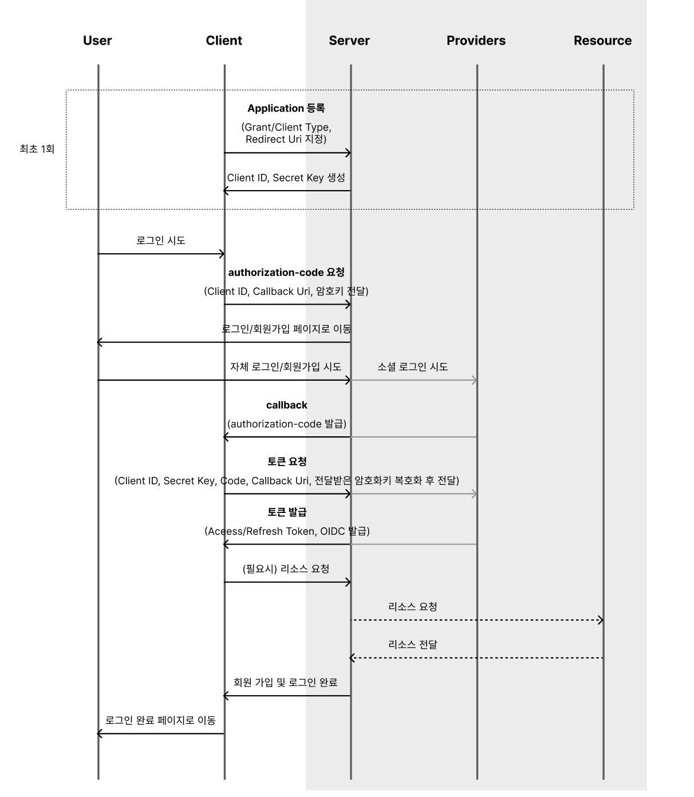

import styles from './index.module.css';

# 🎫 SSO Server

:::tip
OAuth2.0 SSO Server 구축
:::

## 용어.

---

<div className={styles.docsSSOWord}>
    <div>
        <details>
            <summary><strong>OAuth2</strong></summary>
            <div>
                <div>OAuth 2.0은 제3자 애플리케이션이 사용자의 인증 정보 없이 사용자가 보호된 리소스에 접근할 수 있는 권한을 부여하는 프로토콜입니다. 이를 위해 인가 서버가 사용자에게 권한을 요청하고, 사용자가 승인한 후, 인증 코드를 발급합니다. 이 인증 코드를 이용하여 액세스 토큰을 발급하고, 이를 이용하여 보호된 리소스에 접근할 수 있습니다. OAuth 2.0은 여러 가지 권한 부여 방식(grant type)을 지원하며, 그중에서도 가장 일반적이고 안전한 Authorization Code Grant 방식을 사용하는 것이 권장됩니다.</div>
            </div>
        </details>
    </div>
    <div>
        <details>
            <summary><strong>OIDC</strong></summary>
            <div>
                <div>OpenID Connect(OIDC)는 OAuth 2.0 프로토콜을 기반으로 한 사용자 인증 및 인가 프로토콜입니다. OIDC는 OAuth 2.0과 함께 사용되며, 사용자의 정보를 안전하게 보호하고, 클라이언트 애플리케이션이 사용자 인증을 위해 인증 과정을 거칠 수 있도록 지원합니다. OIDC는 기존의 OAuth 2.0 방식에서 사용자 인증을 위한 표준화된 방식을 제공함으로써, 보안성과 편의성을 모두 확보할 수 있도록 합니다.</div>
            </div>
        </details>
    </div>
</div>
<div className={styles.docsSSOWord}>
    <div>
        <details>
            <summary><strong>SSO</strong></summary>
            <div>
                <div>SSO는 Single Sign-On의 약어로, 사용자가 여러 애플리케이션 또는 서비스에 로그인할 때마다 각각 인증을 받는 대신, 한 번의 로그인으로 여러 애플리케이션 또는 서비스에 접근할 수 있도록 하는 인증 방식입니다. SSO를 구현하려면 일반적으로 OAuth 2.0 및 OpenID Connect(OIDC)과 같은 인증 및 인가 프로토콜을 사용합니다.</div>
            </div>
        </details>
    </div>
    <div></div>
</div>


## Grant Type.

---

| 종류                                      | 설명                                                                                                                            | 비고 |
|-----------------------------------------|-------------------------------------------------------------------------------------------------------------------------------|----|
| Authorization Code                      | • 가장 **일반적**이고 안전한 방법     <br/>• 사용자가 인증 서버에 인증하고, 인가된 응용 프로그램이 인증 코드를 받음 <br/>• `인증 코드`를 이용하여 `액세스 토큰`을 요청하고, 이를 이용하여 리소스 접근 |    |
| Implicit                                | • Authorization Code Grant와 유사하지만, 인증 코드 대신 액세스 토큰을 바로 받음 <br/>• **사용자의 브라우저를 통해 요청**되므로, 보안성이 낮음                             |    |
| Resource Owner<br/>Password Credentials | • 사용자의 `아이디`와 `패스워드`를 사용하여 액세스 토큰을 바로 받음 <br/>• 보안성이 낮으므로, **권장되지 않는 방법**                                                         |    |
| Client Credentials                      | • 클라이언트가 직접 액세스 토큰을 받음 <br/>• 사용자와 관련이 없는 리소스에 대한 액세스에 사용                                                                     |    |

<br/>

## SSO 서버 구조.
---



## 사이트 정보

**💻 소스코드** : https://github.com/lee-lou2/sso


## 기능

- 사용자 등록 및 로그인
- 사용자 인증 정보의 중앙 집중 관리
- 다중 애플리케이션 간 SSO 지원

## 요구 사항

- Python 3.x
- Django 3.x

## 주요 라이브러리

- django-oauth-toolkit
- allauth

## 설치

1. 리포지토리를 클론합니다.

```
git clone https://github.com/lee-lou2/sso
```

2. 가상 환경을 만들고 활성화합니다.

```
python3 -m venv venv
source venv/bin/activate
```

3. 종속성을 설치합니다.

```
cd sso
pip install -r requirements.txt
```

4. 환경 변수를 설정합니다.

```
# .env.sample 키에 해당하는 값을 작성합니다
```

5. 데이터베이스를 마이그레이션합니다.

```
python manage.py migrate
```

6. 서버를 실행합니다.

```
python manage.py runserver
```

7. 브라우저에서 `http://localhost:8000`으로 접속하여 서버를 확인합니다.

## 설정

### SSO 클라이언트 등록

1. 클라이언트 생성 페이지로 이동
    1)  {SERVER}/oauth2/applications/

- `name`: 클라이언트 이름
- `client_id`: 클라이언트 식별자
- `client_secret`: 클라이언트 비밀 키
- `Redirect uris`: 클라이언트의 콜백 URL
- `Client type`: Confidential 선택
- `Authorization grant type`: Authorization code 선택
- `Algorithm`: RSA 선택

### 기타 설정

- `SECRET_KEY`: Django 애플리케이션의 비밀 키
- `ALLOWED_HOSTS`: 허용된 호스트 리스트

## 사용법

### [ Golang ]

1. 로그인 페이지 리다이렉션 링크 생성

```go
// GetRedirectUri 로그인 페이지로 리다이렉트할 URI를 반환
func GetRedirectUri() (string, error) {
	codeVerifier, err := getCodeVerifier()
	if err != nil {
		return "", err
	}
	codeChallenge := getCodeChallenge(codeVerifier)

	redirectURI := fmt.Sprintf(
		"%s/oauth2/authorize/?"+
			"response_type=code&"+
			"code_challenge=%s&"+
			"code_challenge_method=S256&"+
			"client_id=%s&"+
			"redirect_uri=%s&"+
			"state=%s",
		os.Getenv("OAUTH2_SSO_SERVER_HOST"),
		url.QueryEscape(codeChallenge),
		url.QueryEscape(os.Getenv("OAUTH2_CLIENT_ID")),
		url.QueryEscape(os.Getenv("OAUTH2_CALLBACK_URL")),
		url.QueryEscape(codeVerifier),
	)
	return redirectURI, nil
}
```

2. 로그인 후 Authorization code 발급


3. 코드를 이용해 토큰 발급

```go

// tokenResponse 토큰 응답
type tokenResponse struct {
	AccessToken  string `json:"access_token"`
	ExpiresIn    int    `json:"expires_in"`
	TokenType    string `json:"token_type"`
	Scope        string `json:"scope"`
	RefreshToken string `json:"refresh_token"`
	IdToken      string `json:"id_token"`
}

// GetToken 토큰 가져오기
func GetToken(code, state string) (*tokenResponse, error) {
	var respData tokenResponse

	data := url.Values{}
	data.Set("client_id", os.Getenv("OAUTH2_CLIENT_ID"))
	data.Set("client_secret", os.Getenv("OAUTH2_CLIENT_SECRET"))
	data.Set("code", code)
	data.Set("code_verifier", state)
	data.Set("redirect_uri", os.Getenv("OAUTH2_CALLBACK_URL"))
	data.Set("grant_type", "authorization_code")
	payload := strings.NewReader(data.Encode())

	// 요청
	resp, _ := requests.Http(
		"POST",
		os.Getenv("OAUTH2_SSO_SERVER_HOST")+"/oauth2/token/",
		payload,
		&requests.Header{
			Key:   "Cache-Control",
			Value: "no-cache",
		},
		&requests.Header{
			Key:   "Content-Type",
			Value: "application/x-www-form-urlencoded",
		},
	)
	if resp.StatusCode != 200 {
		return nil, fmt.Errorf("토큰 조회를 실패하였습니다 : %s", resp.Body)
	}
	if err := json.Unmarshal([]byte(resp.Body), &respData); err != nil {
		return nil, err
	}
	return &respData, nil
}
```

3. 토큰을 이용해 사용자 정보 조회 등 활용