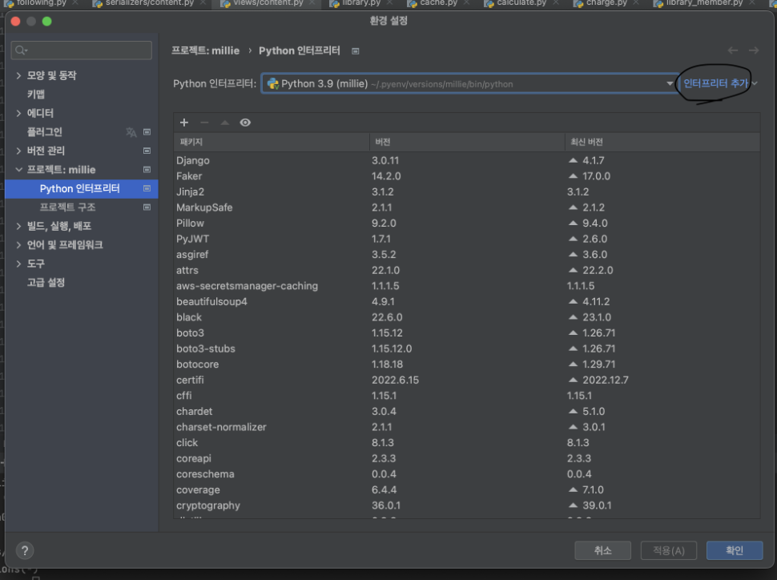
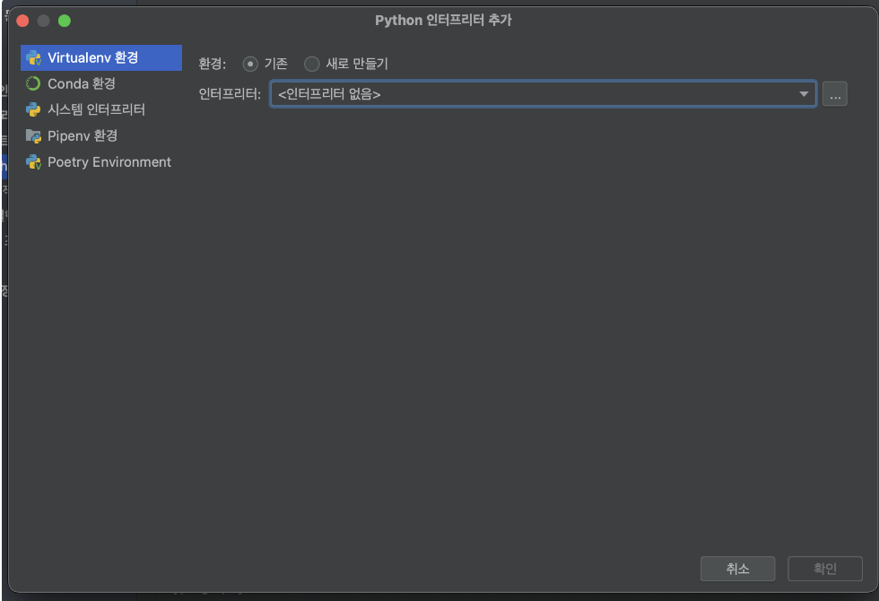

import styles from './index.module.css'

# 파이썬 준비 및 기본

<div className={styles.installLayout}>
<div className={styles.installLayoutLeft}>

## pyenv 설치(mac)

</div>
<div className={styles.installLayoutRight}>

### 1. brew 설치
1. 공식 홈페이지 : [https://brew.sh/index_ko](https://brew.sh/index_ko)
2. `/bin/bash -c "$(curl -fsSL https://raw.githubusercontent.com/Homebrew/install/HEAD/install.sh)"`
### 2. pyenv 설치
1. brew install pyenv
### 3. virtualenv 설치
1. brew install pyenv-virtualenv

</div>
</div>

---

<div className={styles.installLayout}>
<div className={styles.installLayoutLeft}>

## pyenv 를 이용한 Python 다운로드

</div>
<div className={styles.installLayoutRight}>

### 1. pyenv install 3.9.11(버전)

</div>
</div>

---

<div className={styles.installLayout}>
<div className={styles.installLayoutLeft}>

## virtualenv 설정

</div>
<div className={styles.installLayoutRight}>

### 1. pyenv virtualenv 3.9.11 {name}
name = 원하는 가상 환경명

</div>
</div>

---

<div className={styles.installLayout}>
<div className={styles.installLayoutLeft}>

## 파이참 설정

</div>
<div className={styles.installLayoutRight}>

### 1. 파이참 실행
### 2. 원하는 프로젝트/신규 프로젝트 생성
### 3. 인터프리터 설정
1. 인터프리터 추가
   

2. 로컬 인프리터 추가
3. Virtualenv 환경
   

4. /Users/{my_user}/.pyenv/versions/{name}/bin/python 파이썬 파일 적용
    1. my_user = 내가 맥에 로그인한 사용자
    2. name = 위에서 만든 가상 환경명

</div>
</div>

---

<div className={styles.installLayout}>
<div className={styles.installLayoutLeft}>

## 타입 및 특징

</div>
<div className={styles.installLayoutRight}>

### str : 문자열

```python
word = "word"
new_word = f"new {word}"
```

### int : 정수

```python
age = 10
```

### float : 실수

```python
pi = 3.14

# 주의 - 부동 소수점의 문제(완전한 0이 아니다!)
0.1 * 3 == 0.3
# False

1.2 - 0.1 == 1.1
# False

# 해결 방법
import decimal

decimal.Decimal('1.0')
# round 등...
```

### list : 리스트

```python
array = [1, 1, None, "word"]

array[0]
# 1
array[-1]
# "word"
array[:1]
# [1]
array[1:]
# [1, None, "word"]

array.pop()
# "word"
# array = [1, 1, None]

arrary.append(9)
# array = [1, 1, None, 9]
```

### tuple : 튜플 - *수정 불가*

```python
tu1 = (1,)
tu2 = (1, 2)

tu1 + tu2
# (1, 1, 2)

tu1 * 2
# (1, 1)
```

### dict : 딕셔너리

```python
iam = {
    "name": "jake",
    "age": 99
}

iam["name"]
# jake

iam.get("name")
# jake

iam["weight"]
# !Exception

iam.get("weight")
# None
```

### bool : 블리언

```python
select = True
```

### set : 집합 - *중복 데이터 X*

```python
unique = {1, 2, 3}
```

</div>
</div>

---

<div className={styles.installLayout}>
<div className={styles.installLayoutLeft}>

## 데이터 변환

</div>
<div className={styles.installLayoutRight}>

### `int` to `str`

```python
age = 10
# 10

str_age = str(age)
# "10"
```

### `str` to `int`

```python
str_age = "10"

age = int(str_age)
# 10

err_age = "열살"
age = int(err_age)
# !Exception

# 오류 발생하지 않게 하기
if str(str_age).isdecimal():
    age = int(str_age) 

if str(err_age).isdecimal():
    age = int(err_age)
else:
    age = None
```

### `flot` to `int` / `int` to `float`

```python
int_money = 1000
float(int_money)

float_money = 1000.0
int(float_moeny)
```

### `dict` keys / values

```python
iam = {
    "name": "jake",
    "age": 99
}

iam.keys()
# ["name", "age"]

iam.values()
# ["jake", 99]

iam.items()
# [("name", "age"), ("jake", 99)]
```

- `bool`

```python
if None
# False

if 0
# False

if [] or ()
# False

if ""
# False
```

</div>
</div>

---

<div className={styles.installLayout}>
<div className={styles.installLayoutLeft}>

## 자주 사용하는 메소드

</div>
<div className={styles.installLayoutRight}>

### type

```python
word = "str"

type(word)
# str

if type(word) == str:
    print("True")
# True
```

### len

```python
array = [1, 2, 3]

len(array)
# 3
```

### filter

```python
array = [1, 2, None]

new_array = filter(lambda x: x != None, array)
list(new_array)
# [1, 2]
```

### sorted, sort

```python
rank = [2, 1, 3]

rank = sorted(rank, key=lambda x: x)
# [1, 2, 3]
rank = sorted(rank, key=lambda x: x, reverse=True)
# [3, 2, 1]
```

### map

```python
rank = [1, 2, 3]

list(map(lambda x: str(x), rank))
# ["1", "2", "3"]

list(map(lambda x: x * 2, rank))
# [2, 4, 6]
```

### enumerate

```python
words = ["a", "b", "c"]

for i, word in enumerate(words):
    print(i, word)
# 0 "a"
# 1 "b"
# 2 "c"

iam = {
    "name": "jake"
}

for i, (k, v) in enumerate(iam.items()):
    print(i, k, v)
# 0 "name" "jake"
```

### iterator

```python
words = ["a", "b", "c"]

iter_words = iter(words)
next(iter_words)
# "a"
next(iter_words)
# "b"
next(iter_words)
# "c"
next(iter_words)
# !Exception(StopIteration)
```

### range

```python
for i in range(10):
    print(i)
# 0
# 1
# ...
# 9
```

### decorator

```python
    - def decorator_method(func):
    def wrapper(*args, **kwargs):
    print("pre")
    func(*args, **kwargs)
    print("post")
    return wrapper

@decorator_method
def run():
print("run")

run()
# pre
# run
# post
```

</div>
</div>